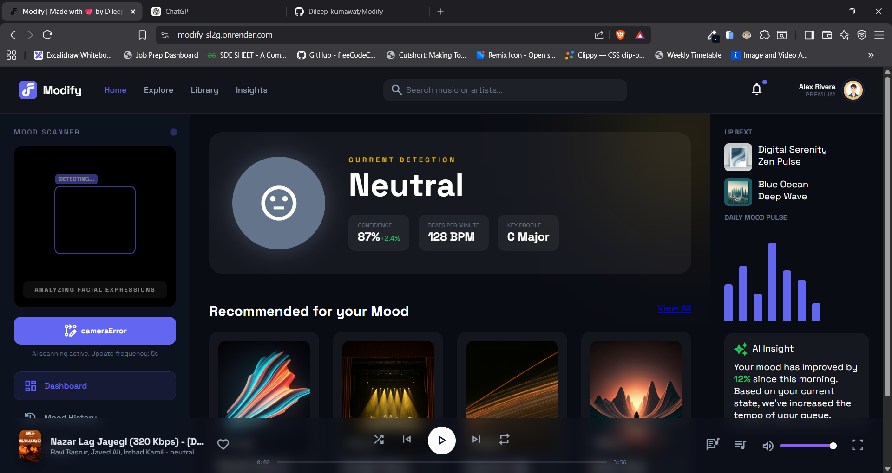

# 🎵 Modify - AI Mood Based Music Player

**Modify** is an AI-powered web application that detects a user's **facial expression in real time** and automatically plays music that matches their **current mood**.

Instead of manually choosing songs, the app reads your emotions through your **webcam** and selects music accordingly.

Live Demo
🔗 [https://modify-sl2g.onrender.com/](https://modify-sl2g.onrender.com/)

GitHub Repository
🔗 [https://github.com/Dileep-kumawat/Modify](https://github.com/Dileep-kumawat/Modify)

Demo video
🔗 [https://youtu.be/t-27onIO3NY](https://youtu.be/t-27onIO3NY)

---

# 🚀 Features

### 🎭 Real-Time Facial Emotion Detection

The application uses your **webcam** to capture facial expressions and classify emotions such as:

* Happy
* Sad
* Angry
* Neutral
* Surprised
* Fearful

### 🎧 Automatic Music Recommendation

Once an emotion is detected, the app automatically plays music that fits your mood.

Example mapping:

| Emotion   | Music Mood         |
| --------- | ------------------ |
| Happy     | Energetic / Upbeat |
| Sad       | Calm / Soft        |
| Angry     | Intense / Rock     |
| Neutral   | Chill / LoFi       |
| Surprised | Energetic          |
| Fearful   | Relaxing           |

### 📷 Webcam Integration

The app uses your **browser camera** to analyze facial expressions live.

### ⚡ Fast & Interactive UI

Lightweight interface with instant emotion detection and music playback.

### 🌐 Web Based

No installation required. Just open the link and allow camera access.

---

# 🧠 How It Works

1. The browser requests **webcam access**
2. The app captures frames from the camera
3. A **facial emotion detection model** analyzes the face
4. The detected emotion is classified
5. Music corresponding to that emotion is played automatically

Pipeline:

```
Webcam → Face Detection → Emotion Recognition → Mood Mapping → Music Playback
```

---

# 🛠 Tech Stack

### Frontend

* HTML
* CSS
* JavaScript
* SCSS
* React

### Backend

* NodeJS
* ExpressJs
* MongoDB

### AI / ML

* Face Detection Model
* Emotion Recognition Model

### Libraries

* mediapipe
* Multer
* node-id3

### Deployment

* Render

---

# 📸 Screenshots



---

# ⚙️ Installation & Setup

If you want to run the project locally:

### 1️⃣ Clone the repository

```bash
git clone https://github.com/Dileep-kumawat/Modify.git
```

### 2️⃣ Navigate into the project

```bash
cd Modify
```

### 3️⃣ Install dependencies (if applicable)

```bash
npm install
```

### 4️⃣ Run the server

```bash
npm start
```

### 5️⃣ Open in browser

```
http://localhost:3000
```

Allow camera access when prompted.

---

# 🌍 Live Application

Try the project here:

👉 [https://modify-sl2g.onrender.com/](https://modify-sl2g.onrender.com/)

Make sure to **enable your camera**.

---

# 🎯 Future Improvements

Possible upgrades:

* 🎵 Spotify API integration
* 🎧 Personalized playlists
* 📊 Mood analytics dashboard
* 🤖 Better emotion detection model
* 📱 Mobile optimization
* 🎶 More music categories

---

# 🤝 Contributing

Contributions are welcome.

Steps:

1. Fork the repository
2. Create a feature branch
3. Commit your changes
4. Push the branch
5. Open a Pull Request

---

# 👨‍💻 Author

**Dileep Kumawat**

* GitHub :
[https://github.com/Dileep-kumawat](https://github.com/Dileep-kumawat)
* Portfolio :
[https://dileep3.netlify.app](https://dileep3.netlify.app)

---

# ⭐ Support

If you like this project:

* ⭐ Star the repository
* 🍴 Fork it
* 🧠 Share ideas for improvements